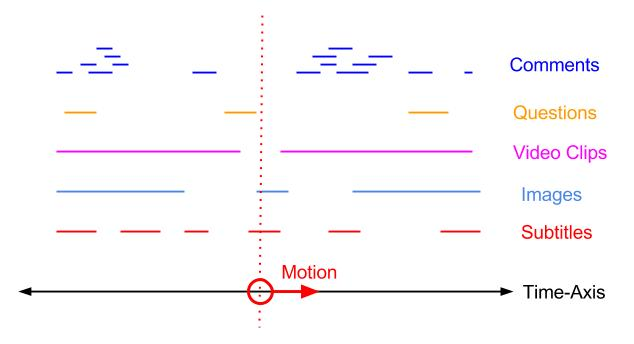
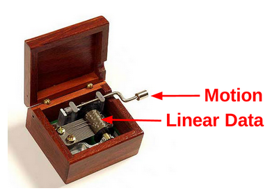

This page gives a wider overview of the Sequencer concept. 

- [introduction](#introduction)
- [music box analogy](#musicbox)
- [media model](#mediamodel) 
- [design goals](#designgoals)
- [related work](#relatedwork) 
- [importance](#importance)
- [future work](#futurework)


<a name="introduction"></a>
## Introduction

The Sequencer works on linear (or timed) data. By linear data we simply mean data that is somehow organised according to an axis, e.g., a point on the axis, or an interval. For example, a subtitle may be structured as follows, where properties *start* and *end* indicate validity related to the time-axis.

```javascript
{
	data : "Hello!",
	start : 24.3,
	end : 28.7
}
```

The figure below also illustrates linear data. It shows how a linear media presentation is defined by motion through linear data. The vertical line is the current position of the motion, defining at any time the “questions”, “movie clips”, “images”, “subtitles” and  “comments” that are valid at the current moment in time. Currently only a single “subtitle” is valid. As motion continues forward, this subtitle will shortly cease to be valid, and need to be removed as motion enters a segment with no subtitle.




<a name="musicbox"></a>
## Music box analogy

The music box below is another effective analogy for the Sequencer. As the illustration shows, the music box takes two kinds of input, linear media and motion. If there is motion, then the music box outputs sounds at the correct moments in time to produce a melody.

The Sequencer similarly works on linear data and motion, and it outputs callback invocation at the correct moments in time. Crucially though, the Sequencer is superior to the music box in two important aspects:

First, the Sequencer is designed to support linear dynamic data. This implies that the raw material of the linear presentation may be modified at any time during playback, in terms of both media content and timing aspects. This may for instance be done directly by viewers interacting with the presentation, or by a production team. The Sequencer ensures that this can occur safely, and it fully encapsulates the complexity that arise from this.

Second. the Sequencer runs on the timing object/shared motion. It maintains time-consistency for any kind of movement supported by the shared motion, be it double speed, backwards, jumping ahead or even acceleration. Furthermore, by virtue of being based on shared motion, the Sequencer may be remote controlled across the Internet. The Sequencer may also play part in synchronised multi-device presentations, presenting the same linear data at multiple screens, or different (related) data sets in a multi-screen production.




<a name="mediamodel"></a>
## Media Model

- **Timeline** A timeline is simply the set of floating point numbers p where min \<= p \<= max. min and max are floating point numbers and may take on values -Infinity or Infinity. Values on the timeline are usually associated with a unit, such as seconds, frame counter or slide number.

- **Timing object** Defines a timeline and movement of a point along this timeline. Point *not moving* (i.e. standing still or paused) is considered a special case of movement. The timing object supports continuous movements (expressed through velocity and acceleration) as well as discrete jumps on the timeline. A discrete jumps from A to B here implies that no time was spent on the transition and that no point p between A and B was visited.

- **Timed data** Objects, whose validity is defined in reference to a timeline. For instance, the validity of subtitles are typically defined in reference to a media timeline. Points and intervals on the timeline is a common way of defining object validity, but not the only way. Timed scripts are a special case of timed data where objects represent operations or commands to be executed.

- **Sequencing** The process of translating timed data or a timed script into timed execution.

- **Timed Media** A timed media presentation is created by mapping timed media content (i.e. timed data) to a common timeline, and applying movement along this timeline. *So, timed media is ultimately created from two distinct entities; timing resources and timed content resources.* No timed content (i.e. empty) is considered a special case. This way, a media presentation may dynamically replace all its timed content during playback/presentation, yet remain well defined at all times. Multiple timingobjects/timelines may be defined for a single media presentation, and media content may define validity with respect to multiple timelines.

- **Online Timed Media** Online timed media is media presentation where at least one resource (timing resource or content resource) is connected to an online resource.

- **Multi-device Timed Media** A timed media presentation where at least one timing object is connected to an online timing resource. It follows that multi-device timed media is also online timed media.

> Timed media is created from two distinct entities; timing objects and timed content.


<a name="designgoals"></a>
## Design goals

A general purpose sequencing mechanisms for the Web, such as [Sequencer](index.html) or [timing text track](http://webtiming.github.io/timingobject/#timing-text-track), would be very useful. It would mean that various kinds of timed data and UI components can easily be integrated and used for timed presentation, without requiring application programmers to re-invent necessary timing logic. Furthermore, by integrating a general purpose sequencing mechanism are with the [timing object](http://webtiming.github.io/timingobject), media products using this mechanims would readily be open for synchronization and external control, both in single-device and multi-device scenarios.

Below we list important design goals for a general purpose sequencing mechanism for the Web.  

- **Data-independency**. The sequencing mechanism should be implemented without reference to any specific data format. This way, timing support for a wide range of data formats can be provided, including application-specific data formats.
 
- **UI-independency**. The sequencing mechanism should not be bundled with any predefined UI elements or UI frameworks. This ensures that programmers are free to exploit it for any purpose, including purposes that require custom UI solutions or no UI at all. General purpose UI components for timed presentation may still be developed and shared independently.

- **Precise timing**. The sequencing mechanism should be based on a precise timeout mechanism (e.g. setTimeout) for enter/exit events to be emitted with high precision, ideally correct down to a single millisecond. This additionally ensures effectiveness with respect to power consumption.

- **Expressive controls**. The sequencing mechanism should support any motion supported by the timing object, including fast forward, slow motion, backwards playback, immediate jumps or acceleration. This way, the sequencing mechanism may support a variety of media control primitives, appropriate for a wide range of media applications.

- **Dynamic data** The sequencing mechanism should allow modifications of timed data to safely occur at any time, with immediate and consistent effects, and without introducing any added complexity for the programmer. This would enable both live authoring and live viewing of dynamic timed media, applicable in both single-device and collaborative, multi-device scenarios.

- **Simple usage**


<a name="relatedwork"></a>
## Related work

All media frameworks includes some form of timeline, playback controls and sequencing logic.

#### TextTracks
In the Web, text track support is integrated with media elements, allowing for instance subtitles and chapter information to be aligned with video playback. The text tracks are open for any data, but the video UI logic is set up to recognize certain track types such as subtitles of different languages. Similarly, [popcornjs](http://popcornjs.com) is a javascript framework allowing anything web to be synchronized with video playback. While this approach is useful, it also comes with some limitations. The timing model of the video element is push-based and non-deterministic, and the implementation of the sequencing logic seems to be poll-based, making the timing precision of enter/exit events rather coarse. Even worse, the tight integration with the video element does not simplify the construction of media presentations with multiple media elements, or with no media element at all.

#### SMIL
Synchronized Multimedia Integration Language [SMIL](http://www.w3.org/TR/SMIL) is a media framework allowing the integration and playback of various media types. Temporal aspects such as paralellism, sequentialism and repetitions may be expressed through a dedicated declarative language. SMIL addresses temporal interoperability, but only within the confines of the framework. Internally it likely has concepts similar to the timing object and the sequencer. However, these concepts are only available through the use of SMIL's declarative HTML-inspired authoring model. Declarative syntax like this quickly grows complicated and cumbersome to work with. Separation between content and presentation tends to be weak. Furthermore, declarative syntax is not highly flexible and often works best when media content is largely static. In contrast, real-world sources for timed data are often represented in application specific formats, and increasingly dynamic - particularly in live production scenarios.

#### Web Animation
[Web Animations](http://www.w3.org/TR/web-animations) is a framework for animations with progress controls. Concepts of timelines and progress controls are similar to the timing object. The animation framework is concerned with the construction animations from a variety of mathematical functions, how they can be combined and parameterized, and how they can be anchored to the timeline. These animations are then sampled in real time to provide gradual changes in output values. Various sampling rates can be specified for different animations. In contrast, the Sequencer operates based on timeouts instead of repeated evaluation. This means that the Sequencer primarily targets abrupt changes at precisely the correct time, rather than coarser poll-based detection of gradual change. For this reason, the Sequencer is more relevant for discrete phenomena, where timed objects are distributed more sparsely or un-evenly along the timeline. The Sequencer is also more efficient with respect to power consumption. Crucially, the main point is to combine a sequencers with animations. For instance, a sequencer can be used to load and un-load an animation at the correct time, whereas the use of animations can be limited to gradual phenomena, for instance smoothing the abrupt transitions driven by the sequencer. With animations driven by the timing object, animations and sequencers would even be precisely coordinated in time.

#### Web Audio
[Web Audio](http://webaudio.github.io/web-audio-api/) The Web Audio API offers web support for creation and playback of music. The core of this framework has much to do with timing, as the framework allows music to be generated based on sequencing of audio samples. Multi-device timing would enable these tools to be put to work in multi-device scenarios, such as collaborative live music production and multi-device concerts. If so, the internal sequencer of the Web Audio framework would have to integrate with the timing object. The current sequencer likely uses the system clock directly. If so, time shifting is likely not handled by its sequencer, but instead handled by re-mapping media samples to the timeline. Integration with timing object and sequencer would probably not be difficult and simplify integration of the Web Audio framework with other timed components, both in single and multi-device scenarios.


<a name="importance"></a>
## Importance

#### Any kind of timed data, for any purpose

The Sequencer function and API is inspired by text tracks supported by HTML media elements. Unfortunately, the close integration between text tracks and media elements may have obscured the full potential of such sequencing mechanisms. It is commonly believed that the utility is limited to media supplementing video. In contrast, by isolating sequencer logic from media elements, specific data formats and UI solutions, the value of the sequencer as a generic programming tool becomes much more evident. 

- Sequencer logic is easily recognised as a part of any media framework. By providing the Sequencer as a ready made component, programmers may easily build new frameworks and timed components.
- The sequencer may be used to produce web-based visualisations from any kind of timed data, or to organize the correct execution of any timed operation. Examples of timed resources might include timed images, text, CSS, JSON, HTML, scripts, geolocations, sensor-data, SVG, audio samples, canvas operations etc. In other words, anything Web. 
- The sequencer may be used for timed actions that do not result in output (e.g. visual/audio) at all. For instance, consider timed pre-fetching of data or timed network requests in a test setup. 
- The ability to deliver data at the correct time may also be used to reduce complexity in content transfer. In particular, real-time (multi-cast) streams are often used as a mechanism to preserve time-ordering and timing across a network - even though timing relations may be corrupted by transport delay and jitter. With timestamped messages and a sequencer on the receiving end, all temporal relations may be correctly re-created, independent of the mechanism used for data transfer. This gives more flexibility in the choice of transport mechanism, and reduces complexity at the sender-side.


#### Defining the state of linear media

The sequencer is particularly suited for the construction of linear media. Essientially, the construction of linear media comes down to a few central challenges.

1. how the linear state is represented. The state must be well defined for all positions on the timeline.
2. how the linear state is used to render output (e.g. visuals) at a given position
3. how the linear state is used to modify the rendered output (e.g. visuals) during playback (relative to previous rendering).

Linear state can be represented in more than one way. For example, consider the linear presentation of a chess game. The linear state of this game may be defined either as 1) a sequencer of board positions, or 2) as a sequence of piece moves. Which to choose is up to the programmer.

1) If linear state is a sequence of board positions, each board position will be mapped to an interval on the timeline. Enter and exit events from the sequencer will then trigger state transitions in the presentation. 

2) If linear state is a sequencer of piece moves, each piece move will be mapped to a singular point on the timeline. Events from the sequencer may then be used to calculate board positions by applying a piece move to the previous position.

Approach 2) is somewhat similar to the classical model for state representation in continuous media, where media content is represented as a sequence of snapshots (I-frames) and virtual snapshots are calculated from diffs (P-frames, B-frames). This model is attractive for any kind of sensor data stream where each data point has a large footprint in bytes, but where diffs between data points can be expressed more effectively. By mapping snapshots to intervals and diffs to singular points, the Sequencer might be used as playback engine also for such a data model.   


<a name="futurework"></a>
## Future work

The Sequencer is fairly complete, yet there may still be avenues for further work.

#### New Sequencer types and features

- This Sequencer only supports timing based on interval and singular points on the timeline. Though this will likely be of common utility, other ways of mapping objects to a timeline might also be conceivable.  
- Repetition and periodicity is also a common theme in timed data, particularly in the context of music. The current Sequencer does not have any support for this. It is possible to solve this by allowing individual cues, or all cues within an interval, to be associated with a repeat interval. Another approach to the same effect would be emulate a timing object which loops inifinitely over a specific interval on the timeline.

#### Sequencer implementations in other languages.
The value of this timing model and concepts like timing objects and sequencers, is not limited to JavaScript and the Web. Implementations of these concepts for other programming languages and environments would ultimately allow temporal interoperability across a variety of platforms. For a programmer, the experience of controlling a multi-device Web presentation from a terminal application, and vice versa, would likely highlight the great value of temporal interoperability.

